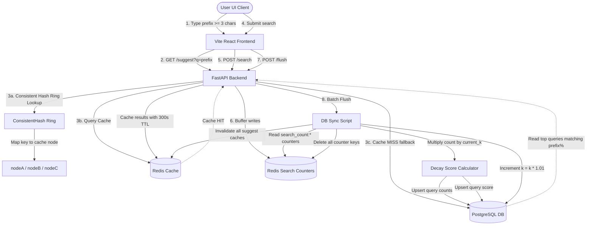

Daksh Shah 24bcs10092
# Distributed Search Typeahead & System Design Dashboard

A complete, high-performance **Search Typeahead System** designed as a High-Level Design (HLD) demonstration. The system illustrates key distributed database and caching principles including **Consistent Hashing**, **Write-Back Buffering (Batch Writes)**, and **Recency-Aware Query Ranking** with an exponentially decaying weight factor ($k$).

The project features a **FastAPI backend**, **PostgreSQL** (Source of Truth), **Redis** (Distributed Cache & Write Buffer), and a premium **React + Vite Dashboard** showing real-time system metrics, cache node routing, buffer status, and live logs.

---

## 🏗️ System Architecture



---

## 🌟 Core System Design Features

### 1. Distributed Caching with Consistent Hashing
Instead of storing all cached suggestions on a single Redis key or node, keys are distributed across **3 logical cache nodes (`nodeA`, `nodeB`, `nodeC`)**:
*   **Virtual Nodes (VNodes):** To ensure uniform distribution of cache keys and prevent hot spotting, each node is mapped to **20 virtual nodes** (total of 60 nodes on the hash ring).
*   **Ring Routing:** The backend hashes the search prefix using `MD5` and performs a binary search (`bisect`) on the sorted ring array to find the nearest virtual node whose hash is greater than or equal to the query hash.
*   **Cache Format:** Cached suggestion lists are saved under `{node}:suggest:{prefix}` namespaces with a **300-second (5-minute) TTL**.

### 2. Write-Back Buffering (Batch Writing)
Directly writing search submissions to the main database on every user request introduces immense disk write I/O pressure. 
*   **Redis Buffering:** When a user submits a search query, the backend calls `POST /search`, which increments an atomic Redis counter `search_count:{query}` in memory. 
*   **Batch Database Writes:** Counts accumulate in Redis. When the **"Trigger Batch DB Flush"** action is executed, all Redis counters are scanned, their totals are synced to the PostgreSQL database in a single database transaction, and the Redis buffer keys are deleted.

### 3. Recency-Aware Trending Queries (Decay Scoring)
Queries should trend based not only on volume but also on **recency** (older searches should decay in weight).
*   **Scoring Equation:** On every flush, the score added to the trending database is calculated as:
    $$\text{Trending Score Increment} = \text{Count} \times k$$
*   **Elastic Decay factor ($k$):** The system state stores a multiplier `current_k`. After each successful batch flush, the value of $k$ is multiplied by $1.01$ (a $1\%$ increase):
    $$k_{\text{new}} = k_{\text{old}} \times 1.01$$
    This ensures that searches submitted in later batches have higher weight multipliers, allowing newer search spikes to quickly overtake older query volumes in the trending tables.
*   **Immediate Cache Invalidation:** When a flush occurs, the backend automatically deletes all keys matching `*:suggest:*` from Redis, ensuring users immediately receive updated suggestions populated with the newly merged counts.

---

## 🔌 API Endpoints Reference

### 1. `GET /suggest?q=<prefix>`
Fetches typeahead suggestions.
*   **Query Params:** `q` (string, minimum 3 chars)
*   **Response (Cache Hit):**
    ```json
    {
      "prefix": "jav",
      "count": 3,
      "cache": "hit",
      "node": "nodeB",
      "suggestions": ["java", "javascript", "java compiler"]
    }
    ```

### 2. `POST /search`
Records a search query submission into the Redis write buffer.
*   **Request Body:** `{"query": "consistent hashing"}`
*   **Response:**
    ```json
    {
      "status": "success",
      "query": "consistent hashing"
    }
    ```

### 3. `GET /trending`
Retrieves the top 10 trending queries sorted by their decaying score.
*   **Response:**
    ```json
    {
      "count": 2,
      "queries": [
        { "query": "react hooks", "score": 10.406 },
        { "query": "system design", "score": 5.203 }
      ]
    }
    ```

### 4. `POST /flush`
Flushes the Redis counter buffers to the PostgreSQL tables and decays the ranking multiplier.
*   **Response:**
    ```json
    {
      "status": "success",
      "flushed_count": 5,
      "old_k": 1.03,
      "new_k": 1.0403,
      "flushed_queries": [
        { "query": "python uvicorn", "count": 2, "score": 2.06 }
      ]
    }
    ```

### 5. `GET /status`
Fetches current $k$ factor state and number of items queued in the write buffer.
*   **Response:**
    ```json
    {
      "current_k": 1.04060401,
      "buffer_count": 3
    }
    ```

---

## 🛠️ Technology Stack
*   **Backend:** FastAPI (Python 3.10+), SQLAlchemy, Redis-py, Uvicorn.
*   **Databases & Caching:** PostgreSQL 16, Redis 7 (both containerized via Docker).
*   **Frontend:** React (Vite, JavaScript), Vanilla CSS, responsive glassmorphism styles, live logger.

---

## 📂 Project Directory Structure
```text
TypeAhead/
├── backend/
│   ├── app.py                     # Main FastAPI endpoints & CORS
│   ├── consistent_hash.py         # Consistent hashing ring implementation
│   ├── flush_counters.py          # Standalone batch flush script
│   ├── initialize_system_state.py # Initializes current_k in PostgreSQL
│   ├── load_data.py               # Ingests AOL dataset queries to PG
│   ├── create_table.py            # Creates PostgreSQL 'queries' table
│   └── create_trending_table.py   # Creates PostgreSQL 'trending_queries' table
├── frontend/
│   ├── src/
│   │   ├── App.jsx                # Main React interactive dashboard
│   │   ├── App.css                # CSS styles for widgets, console, and layouts
│   │   ├── index.css              # Custom Outfit font and dark-glow system imports
│   │   └── main.jsx               # React DOM injection
│   ├── index.html                 # App layout configuration
│   └── package.json               # Node packages
├── docker-compose.yml             # Local Postgres & Redis configurations
├── README.md                      # Detailed project documentation
└── .gitignore                     # Shared backend/frontend exclusions
```

---

## 🚀 Getting Started

### 1. Prerequisites
Ensure you have the following installed:
*   [Docker & Docker Compose](https://www.docker.com/products/docker-desktop/)
*   [Python 3.10+](https://www.python.org/downloads/)
*   [Node.js (v18+) & npm](https://nodejs.org/)

---

### 2. Ingesting Initial Data (One-Time Setup)

1.  **Start Docker containers:**
    ```bash
    docker compose up -d
    ```
2.  **Set up the Python Virtual Environment:**
    ```bash
    # Create venv
    python -m venv venv
    
    # Activate venv (Windows)
    .\venv\Scripts\activate
    
    # Install dependencies
    pip install fastapi uvicorn sqlalchemy psycopg2-binary redis pandas
    ```
3.  **Run PostgreSQL Initializations:**
    Ensure database tables are initialized and the default $k$ multiplier value is set:
    ```bash
    cd backend
    python create_table.py
    python create_trending_table.py
    python create_system_state.py
    python initialize_system_state.py
    ```
4.  **Ingest Dataset:**
    Import the cleaned search query logs from the `.csv` file into PostgreSQL:
    ```bash
    python load_data.py
    ```

---

### 3. Running the Project

#### **Terminal 1: FastAPI Backend**
Start the backend web API server on port 8000:
```bash
cd backend
..\venv\Scripts\activate
uvicorn app:app --host 0.0.0.0 --port 8000 --reload
```

#### **Terminal 2: React Frontend Client**
Start the Vite developer dashboard client:
```bash
cd frontend
npm install
npm run dev
```

Open your browser to [http://localhost:5173/](http://localhost:5173/) to interact with the project!

---

## 🎯 How to Demo for a Viva/Evaluation

When demonstrating this system to an evaluator, follow these steps to showcase the HLD features in action:

1.  **Test Live Suggestions and Hashing:**
    *   Type a query prefix like `jav` or `iph` in the **Search Simulator Client**.
    *   Watch the **HLD Cache Metrics** dashboard. You will see a `MISS` on the first lookup. 
    *   Notice which cache node was selected (e.g. `nodeB` or `nodeC`) by the Consistent Hashing algorithm.
    *   Type the same query again. The cache status will immediately switch to `HIT` (green glow) with **near 0ms latency**!
2.  **Verify Write Buffering:**
    *   Search for a query that is not currently in the system, e.g. `system design masterclass`. Press **Enter** or click **Search**.
    *   Look at the **Redis Write Buffer** widget: the pending count will increment (e.g. `1 pending`).
    *   Type `system design` back in the search box. You will notice `system design masterclass` **does not** appear in suggestions yet because it hasn't been merged into PostgreSQL.
3.  **Demonstrate Batch Sync & Recency Score Increase:**
    *   Click **Trigger Batch DB Flush**.
    *   Watch the **Live Logs Console**: it will print the sync details, delete the search counter from Redis, increment the $k$ value by $1\%$, and clear suggestions cache keys.
    *   Type `system design` again: `system design masterclass` now appears in the typeahead dropdown list immediately.
    *   Verify the **Top Trending Queries** panel: the query has now entered the leaderboard with its newly calculated score.
